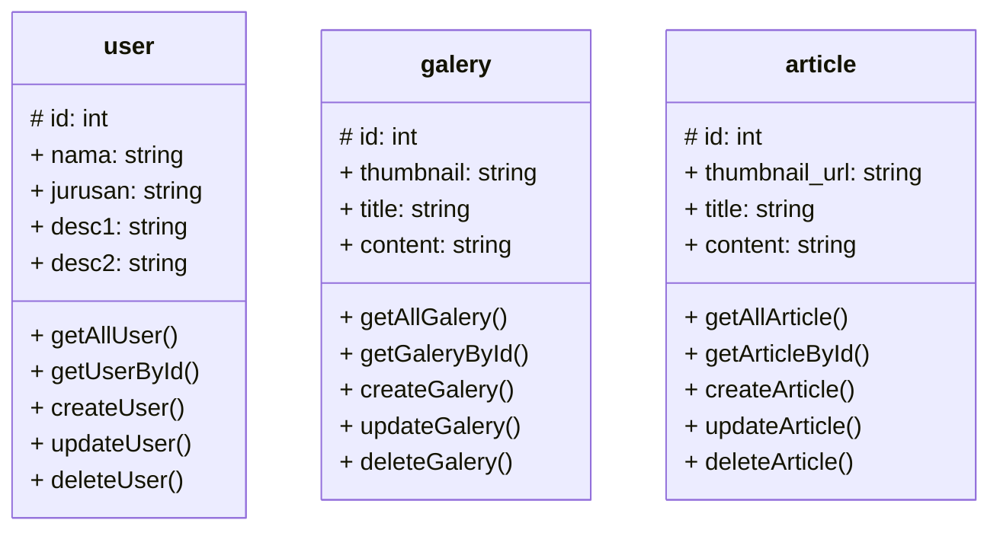

## API POINTS

Berikut adalah api point yang digunakan untuk membangun portfolio saya di antaranya user, galery, dan article

### User

> getAllUser()

getAllUser adalah fungsi dimana ketika hendak mengambil data dari seluruh pengguna

```
GET: /user

response:
[
    {
        "id"            : "",
        "nama"          : "",
        "jurusan"       : "",
        "desc1"         : "",
        "desc2"         : "",
    },
    ...
]
```

> getUserById()

getUserById merupakan fungsi ketika ingin mengambil/memanggil data user berdasarkan `id`

```
GET: /user/[id]

response:
{
    "id"            : "",
    "nama"          : "",
    "jurusan"       : "",
    "desc1"         : "",
    "desc2"         : "",
},
```

> createUser()

createUser merupakan fungsi untuk menambahkan data pengguna/user

```
POST: /user

headers:
{
    Content-type: 'application/json',
    Authorization: 'Bearer [access_token]'
}

body:
{
    "nama"          : "",
    "jurusan"       : "",
    "desc1"         : "",
    "desc2"         : "",
}

response:
true    // if success
false   // if failure
```

> updateUser()

updateUser merupakan fungsi ketika kita hendak mengubah sebuah data pada user tertentu

```
PUT: /user

headers:
{
    Content-type: 'application/json',
    Authorization: 'Bearer [access_token]'
}

body:
{
    "id"            : "",
    "nama"          : "",
    "jurusan"       : "",
    "desc1"         : "",
    "desc2"         : "",
}
```

> deleteUser()

fungsi deleteUser merupakan fungsi untuk menghapus data pengguna/user dari database

```
DELETE: /user/[id]

headers:
{
    Content-type: 'application/json',
    Authorization: 'Bearer [access_token]'
}

response:
true    // if success
false   // if failure
```

## Galery

> getAllGalery()

getAllGalery merupakan fungsi untuk mengambil semua data galery yang tersimpan di database 

```
GET: /galery

response:
[
    {
        "id"                : "",
        "thumbnail"         : "",
        "title"             : "",
        "content"           : "",
    }
    ...
]
```

> getGaleryById()

getGaleryById merupakan fungsi untuk mengambil data galery berdasarkan `id` tertentu saja

```
GET: /galery/[id]

response:
{
    "id"                : "",
    "thumbnail"         : "",
    "title"             : "",
    "content"           : "",
}
```

> createGalery()

createGalery merupakan fungsi untuk membuat data api galery yang akan di simpan pada server

```
POST: /galery

headers:
{
    Content-type: 'application/json',
    Authorization: 'Bearer [access_token]'
}

body:
{
    "thumbnail"         : "",
    "title"             : "",
    "content"           : "",
}

response:
true    // if success
false   // if failure
```

> updateGalery()

updateUser merupakan fungsi untuk mengubah data galery yang ada pada server database

```
PUT: /user

headers:
{
    Content-type: 'application/json',
    Authorization: 'Bearer [access_token]'
}

body:
{
    "id"                : "",
    "thumbnail"         : "",
    "title"             : "",
    "content"           : "",
}

response:
true    // if success
false   // if failure
```

> deleteGalery()

deleteGalery merupakan fungsi untuk menghapus data glaery pada server

```
DELETE: /galery/[id]

headers:
{
    Content-type: 'application/json',
    Authorization: 'Bearer [access_token]'
}

response:
true    // if success
false   // if failure
```

## Article

> getAllArticle()

getAllArticle merupakan fungsi untuk mengambil semua data article untuk ditampilkan dari server

```
GET: /article

response:
[
    {
        "id"                    : "",
        "thumbnail_url"         : "",
        "title"                 : "",
        "content"               : "",
    }
    ...
]
```

> getArticleById()

getArticleById merupakan fungsi untuk mengambil data article berdasarkan `id` tertentu

```
GET: /article/[id]

response:
{
    "id"                    : "",
    "thumbnail_url"         : "",
    "title"                 : "",
    "content"               : "",
}
```

> createArticle()

createArticle merupakan fungsi untuk membuat data article baru yang akan disimpan pada server database

```
POST: /article

headers:
{
    Content-type: 'application/json',
    Authorization: 'Bearer [access_token]'
}

body:
{
    "thumbnail_url"         : "",
    "title"                 : "",
    "content"               : "",
}

response:
true    // if success
false   // if failure
```

> updateArticle()

updateArticle merupakan fungsi untuk mengubah data pada article

```
PUT: /article

headers:
{
    Content-type: 'application/json',
    Authorization: 'Bearer [access_token]'
}

body:
{
    "id"                    : "",
    "thumbnail_url"         : "",
    "title"                 : "",
    "content"               : "",
}

response:
true    // if success
false   // if failure
```

> deleteArticle()

deleteArticle adalah fungsi untuk menghapus article dari data server

```
DELETE: /article/[id]

headers:
{
    Content-type: 'application/json',
    Authorization: 'Bearer [access_token]'
}

response:
true    // if success
false   // if failure
```

## Desain Database

berikut adalah desain database yang digunakan untuk membangun portfolio saya


